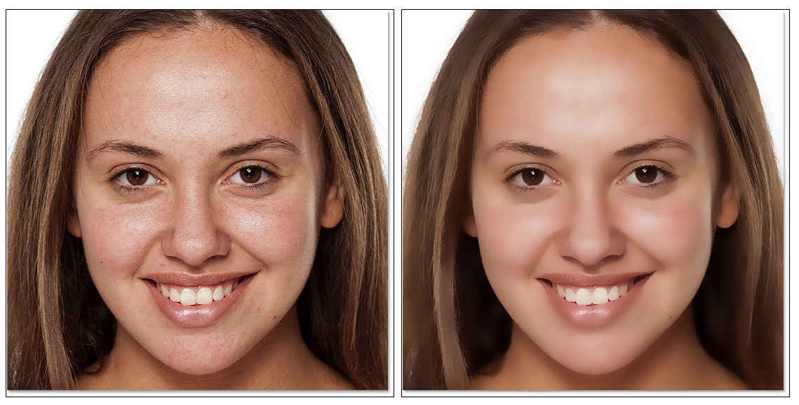
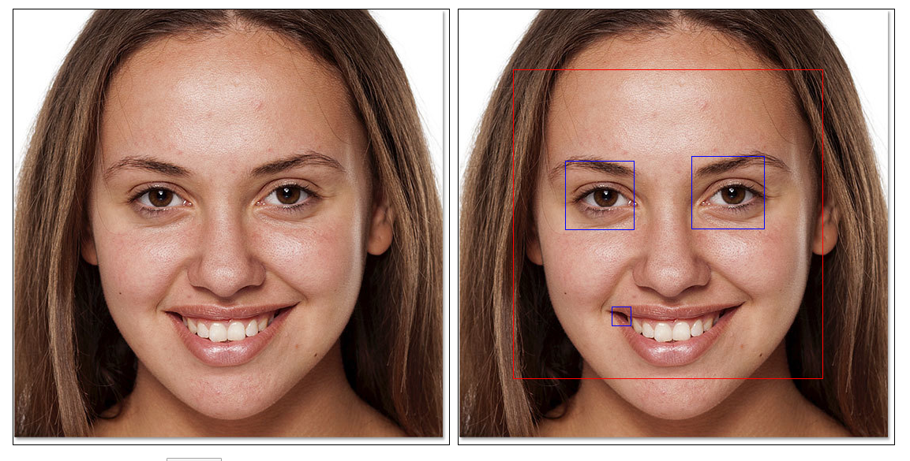

## openCV.js基础介绍

  

本文目标
* openCV.js是什么？
* openCV.js能做什么？
* openCV.js怎么用？
* openCV.js有哪些常见例子？
* openCV.js优缺点有哪些？

### 介绍
openCV(open computer vision)是一个跨平台的计算机视觉库，主要用于图像识别和处理领域。openCV封装300多个API，实现了图像处理和识别方面的很多通用算法。

对于web开发者想学习openCV有几个问题: 
1. 图像识别和处理领域门槛很高，需要一定专业背景;
2. 需要掌握特定的后端语言，比如C++;
3. openCV开发环境配置麻烦;
4. 代码调试成本高;


openCV.js是openCV图像处理库的JS版本，主要用于浏览器环境中。使用openCV.js可以实现多种复杂图像处理和识别，比如脸部美化、人脸识别等功能。对于web开发者openCV.js有下面几个优势:
1. 熟悉的编程语言和开发环境;
2. 代码实时运行，调试成本低，开发效率高;


### 加载openCV.js

openCV官网没有提供openCV.js版本，需要开发者手动进行编译。网上有文章介绍如何编译，这里就不赘述。如果不想编译可以去github下载第三方编译好版本。

加载openCV.js代码如下:
```
<script src="./opencv.js" type="text/javascript"></script> 
```

因为openCV.js文件比较大，为了不影响页面整体展现，可以通过异步非阻塞方法加载，代码如下:
```
<script async src="./opencv.js" type="text/javascript"></script>
```

如果openCV.js加载后需要立即处理图片的话，可以增加一个`onload`事件，代码如下:
```
<script async src=",/opencv.js" onload="openCvReady();" type="text/javascript"></script>
```

### 使用openCV.js
加载openCV成功后，全局环境下会出现一个`cv`对象。`cv`对象包含openCV.js所有属性和方法。

我们试着使用`cv`对象读取一张图片并生成到`canvas`中, 这个过程涉及到两个API:
1. cv.imRead: 读取图片;
2. cv.imShow: 在指定位置生成图片;

整体代码如下:

```html
 
```

```js
var imgElement = document.getElementById("dog");
var mat = cv.imread(imgElement);
cv.imshow("canvasOutput", mat);
mat.delete();
```


### 使用openCV.js常见例子

* 图像美化
* 人脸识别

图像美化是一个最常见图像处理场景，特别是人脸的处理。下面例子是将一个脸上的雀斑进行去除，使用是openCV.js中`双边过滤`算法。代码如下:

```js
let src = cv.imread("imageSrc", 1);
cv.cvtColor(src, src, cv.COLOR_RGBA2RGB, 0);
let dst = new cv.Mat();            
cv.bilateralFilter(src, dst, 19, 75, 75, cv.BORDER_DEFAULT);
cv.imshow("canvasOutput", dst);
```
运行截图
  


人脸识别是图像识别领域最热门应用。当有脸部训练模型后，可以使用openCV.js以实现人脸识别。主要代码如下

```js
let src = cv.imread("imageSrc");
let gray = new cv.Mat();
cv.cvtColor(src, gray, cv.COLOR_RGBA2GRAY, 0);
let faces = new cv.RectVector();
let eyes = new cv.RectVector();
let faceCascade = new cv.CascadeClassifier();
let eyeCascade = new cv.CascadeClassifier();

faceCascade.load("haarcascade_frontalface_default.xml");
eyeCascade.load("haarcascade_eye.xml");

let msize = new cv.Size(0, 0);
faceCascade.detectMultiScale(gray, faces, 1.1, 3, 0, msize, msize);
cv.imshow("canvasOutput", src);
```
运行截图
  

### openCV.js优缺点

openCV.js让web开发者可以进入图像处理和识别领域，从而可以在浏览器上创造出更强大应用。在使用openCV.js之前要调研清楚自己项目是否适用。下面是我总结openCV.js优缺点;

优点：
1. openCV.js功能强大，API丰富;
2. openCV.js版本持续更新和维护;

缺点：
1. openCV.js相关文档缺乏，学习成本高;
2. openCV.js文件体积大，对页面加载速度影响大;
3. openCV.js处理图像会消耗大量计算资源，有时会导致页面卡顿;
4. openCV.js相关社区匮乏，遇到问题解决成本高;


总结：如果对图像处理和识别感兴趣，可以考虑下功夫钻研一下openCV.js。我觉得openCV.js一把屠龙刀。如果有本事用好它，会带来很多好处；如果用不好它，可能会伤到自己。