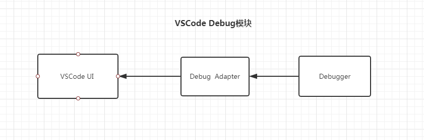

## Vscode Debug模块调试

>Node Debug模块，内置一个调试器, 会将用户调试内容反映在代码中;

>NodeJS 给我们提供了 Debugger 模块，内建客户端，通过 TCP 将命令行的输入传送到内建模块以达到调试的目的。

>When started with the --inspect switch, a Node.js process listens for a debugging client. By default, it will listen at host and port 127.0.0.1:9229. Each process is also assigned a unique UUID.

通过启动Node进程然后监听`debugging client`; 

`Node Debug`调试器结构是什么？ 为什么可以完成debug?

### launch和attach

`launch`是单独开启一个进程。`attach`是依附在一个进程中。

使用`attach`需要注意端口号，`vscode`和浏览器是在特定的端口中进行通信的。正常启动浏览器是不具备这个端口的，需要通过下面命令进行启动
```
 ./chrome.exe --remote-debugging-port=9222 --user-data-dir=/tmp/chrome-debug
```

具体命令如下：
1. 启动Chrome浏览器 ```./chrome.exe --remote-debugging-port=9222 --user-data-dir=/tmp/chrome-debug```;
2. 开启VSCode debug;
3. 在浏览器中输入测试网址;


### `VSCode`和`Chrome`是如何进行Debug联动的

`VSCode`具有哪些模块
;


现象描述：在`VSCode`中打上断点，在浏览器上运行时，`VSCode`就会有响应？

VSCode和Chrome debugger通信方式

VSCode将`Debugger Adapter`独立出去, `VSCode Extension`使用`Debugger Adapter`通过接口和`Debugger`进行通信;

`Chrome Devtools Protocol`通过`--remote-debugging-port=2222`远程接口进行调试，在`--user-data-dir`存用户数据;


#### 插件分析

研究一下vscode debuger相关技术:

1. 主要分为两大类：Chrome和Node;
2. Chrome分为：launch和attach;
3. Node分为多种类型：Mocha、Yoeman等;

分别看一下Chrome和Node环境下调试;

Node环境支持ES6调试吗？

创建一个调试工具:
0. 可以打断点，然后调出工具来，简单两步就可以完成调试;
1. 可以设置很多值统一运行，如果出错的话可以调出debug工具来;
2. 单独调试;


功能点:
1. 怎么获取当前文件路径;
2. 启动模块命令;
3. 怎么在编辑器中debug;
4. 怎么浏览器中debug;


拓展阅读：

1. [Debugger Extension](https://code.visualstudio.com/api/extension-guides/debugger-extension)
2. [Chrome Devtools Protocol](https://chromedevtools.github.io/devtools-protocol/#endpoints)
3. [VSCODE 调试器实现原理及实现在线编辑器的调试功能 #13](https://github.com/Aaaaash/blog/issues/13)
4. [vscode-debug-examples](https://github.com/forsigner/vscode-debug-examples)