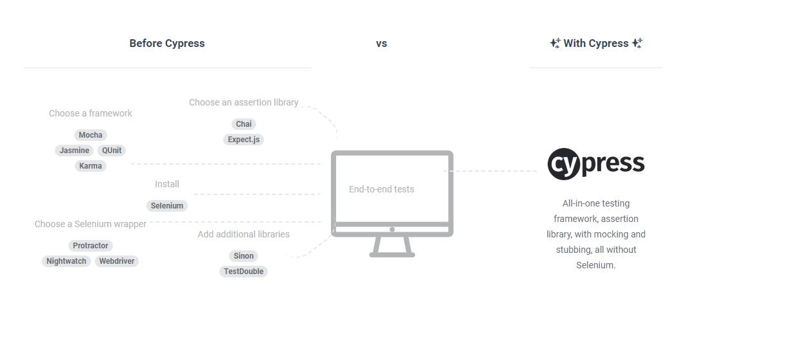
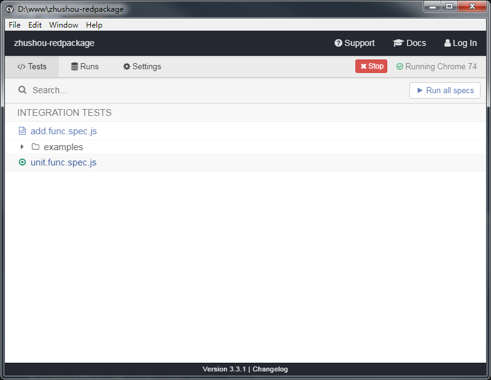
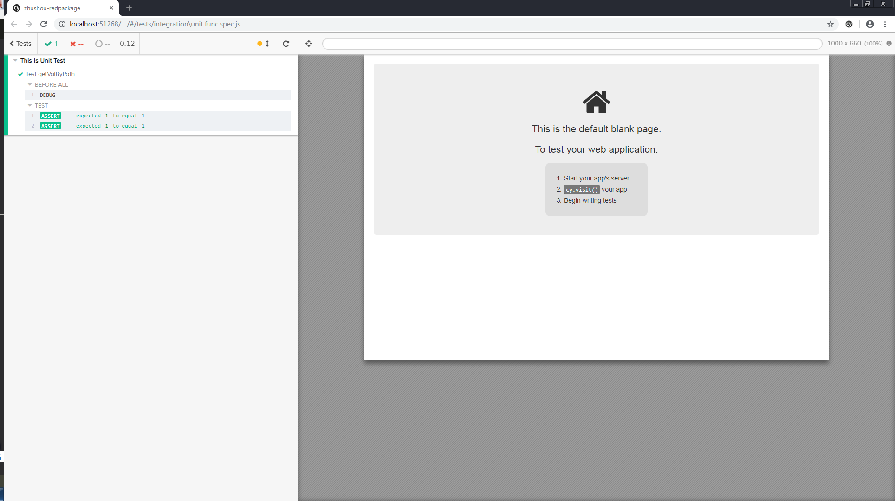

## cypress代码测试介绍

目录
* 要解决什么问题？
* cypress是什么？    
    * 断言库
* cypress具有哪些功能？
    * screenshot
    * 视频
    * 任务栏介绍    
* cypress怎么使用？
    * 命令行启动
    * 
* cypress在实际项目中的应用?
    * 编写单元测试
    * 进行UI检测

* cypresss不足    

### 要解决的问题

__前端代码越来越复杂，测试成本越来越高.__

常见问题场景：

1. 新创建的函数没有单独测试入口，需要直接放在业务代码中测试;
2. 新创建的函数需要多步操作才能调用，每次调试需要操作多次才能调用我们想要的函数;
3. 新创建的函数传入一些数据成功，换一批数据就报错了;


### cypress是什么？
cypress是前端测试工具。具有单元测试、集合测试和端到端测试整体功能，实现对代码和UI一站式测试需求。



### cypress怎么使用
···
$ yarn add cypress --dev
···

会在项目中增加`cypress`文件夹, 先将测试代码放在`integration`中;

下一步 在`integration`文件夹中，创建add.func.spec.js文件，并增加单元测试代码:
```js
function add(x, y){
    return x + y;
}

describe("Test Add Function", ()=>{    
    it("test 1 + 1 equal 2 ?", ()=>{                
        expect(add(1, 1)).to.equal(2);
    })
});

```

下一步 open `Cypress`
```
yarn run cypress open
```

打开下面弹出框  


下一步 点击`add.func.spec.js`文件, 会打开浏览器  


最终显示代码测试通过;


#### 常见的断言语法
* equal()、not.equal()： 相等和不相等
* above(): 大于
* true、undefined、null、NaN: 类型判断

UI测试
```js
    cy.get("http://10.129.192.173:3000/fes/lottery?dev=1")


```

还可以使用下面命令：
```js
yarn run cypress run
```


