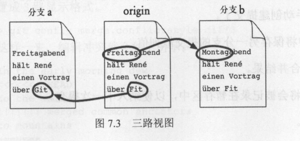

## git

* 概念    
    * 底层    
        * SHA-1 
        * 对象数据库
        * 指针
        * 提交图        
        * 工作区、暂存区、本地仓储库和远程仓储库
    * 状态
    * 提交
    * 拉取
    * 暂存
    * 分支
    * 合并
    * 标签
    * 变基

* 开发中常见情况
    * 修改刚刚commit提交的日志
    * 本地更新代码push不上去
    * 将push代码撤销
    * 本地代码没有提交导致代码pull不下来
    * 开发过程中需要紧急修复bug    

* 关于git几个常见问题
    * fork和clone
    * pull request和pull
    * git pull和git fetch区别

* 进阶概念
    * hard、索引、工作区

### 概念

#### 工作区、暂存区、本地仓储库和远程仓储库


#### Sha-1

```js
    git hash-object README.md
    //97d41f75ff3f9102bf64ea1d87bc1f8ceda08d16
```

`git`会根据文件内容、作者和时间等信息生成一串40个16位字符串;
散列值被用在`blob`、`tree`、`commit`三个地方;

#### 本地仓储库
存储系统分为三类:
1. blob: 存放文件
2. tree: 存放目录
3. commit: 存放提交

#### 指针
git用到指针的两个地方:
* 分支
* 标签

指针标识: `--hard`,指向当前分支;
标签指针指向特定`commit 散列值`

#### 暂存区
为什么`git`有暂存区？ 
1. 可以避免把所有修改都提交，使得提交内容更加灵活;
2. 管理是修改不是文件; 

添加文件到暂存区
```
git add .
```
提交暂存区所有文件
```
git commit -am '提交暂存区文件'
```

通过`checkout`方法可以恢复文件之前内容;
`git checkout 1.txt`

### 基础应用

#### 分支
需要分支两种场景
1. 多人并行开发时需要拉分支;
2. 开发过程中修复之前bug时;

查看分支
`git branch`
创建分支
`git branch 1.0`
切换分支
`git checkout 1.0`
创建和切换分支
`git checkout -b 1.0`

#### 合并
两个分支合并时文件需要合并，如何定位两个文件位置的不同;  




#### 标签

创建标签
```git tag v1.0 -m '1.0版本'```

删除标签
```git tag -D v1.0 ```

从指定标签拉分支
```git checkout -b branch_name tag_name```
 
#### 变基
合并分支两种方式:
```js
git merge 
git rebase
```

多人开发时会创建出多个分支出来，为了让`git log`流程好看一些, 可以通过`git rebase`方式变基让整体提交成串行
```
git rebase v1.0
```

### 开发中常见情况

1. 修改刚刚commit提交的日志


2. 本地更新代码push不上去
先拉取代码再提交
```
git pull 
git push 
```

3. 将push代码撤销
找到前一次`commit`的散列值，使用`reset`命令;
···
git reset --hard 97d41
···
或者使用`revert`
```
git revert HEAD
```

4. 本地代码没有提交导致代码pull不下来
现将本地代码`stash`然后再`pull`代码
```
git stash
git pull 
git stash apply
```

5. 开发过程中需要紧急修复bug
用特定标签新建一个分支
```
//git checkout -b branchName tagName
git checkout -b 1.2.1 v1.2
```


### git常见问题

`git fork`是从服务器对`项目代码库`做复制成为两个项目代码库，后面`push`和`pull`等操作和之前代码库没有关系。
`git clone`则从服务器端对`项目代码库`拷贝一个`本地项目代码库`，后面`push`和`pull`等操作和服务器项目代码库保持联系。

`pull request`是`fork`的原项目进行合入请求;
`pull`从远程代码库更新和合并代码;

`git pull`和`git fetch`的区别  `git pull = git fetch + git merge`
`git fetch`使用的场景是