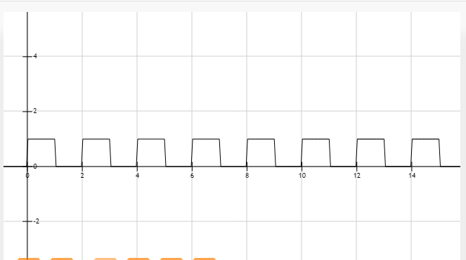

## js实现流程管理

介绍
1. 项目中遇到问题？
2. 有哪些流程？


### 1. 项目中遇到问题

让一个运动物体暂停一段时间;

通过一个时间器来完成，当触发了判断条件后，不执行运动;
```js
    setInterval(()=>{
      area.scrollTop += this.num;
      if(area.scrollTop >= 300 && area.scrollTop != 0){
        area.scrollTop = 0;
      }
      
      if(parseInt(area.scrollTop) % height === 0 && area.scrollTop != 0){

        if(this.startTime == null) {
          this.startTime = new Date().getTime();
        }

        this.currentTime = new Date().getTime();

        if(this.currentTime - this.startTime > 1000){
          this.num = 1;
          this.startTime = null;
        }else{
          this.num = 0;
        }

      }
    }, this.time);
```
这个运动本质是一个曲线，曲线形状如下：  
;

通过这个数学公式可以算出，可以增加的值`y = 1 - (Math.floor(x)%2)`


### 2.有哪些流程？

对于多个事件执行问题，可以使用`webpack tapable`库;


