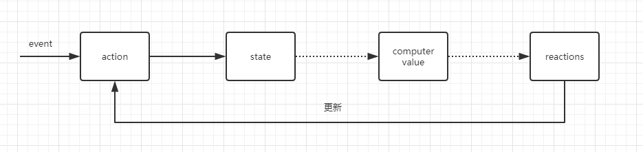

## mobx介绍

目标
1. mobx有哪些功能
    1.1 observale
    1.2 action
    1.3 autorun
    1.4 reactions    

2. mobx流程图

### 1.1 mobx有哪些功能？

#### 1.1 observeable

通过装饰器模式将功能引入进来
```js
import {} from "mbox";
@observe class Store {
    @observe var a = 1;
}

```

#### 1.2 action
```js
import {action} from "mbox";

var store = new Store();
@action var add = function(){
    store.a++;
}
```

#### 1.3 autorun

```js

var store = new Store();
autorun(function(){
    console.log(`store.a = %d`, store.a);
})

···

### 2. mobx运行原理

#### 2.1 mobx原型流程图



流程图主要包含四个部分：

1. action
2. state
3. computed values
4. reactions


`computed values`：通过纯函数对state进行处理；

`reactions`: 数据变化


mobx整体流程符合flux思想: 事件驱动数据，数据驱动UI，但是也有一些不同之处;


