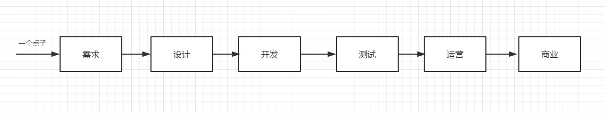

## 前端工程化常见流程

本文目标：
1. 互联网产品有哪些模块
2. 工程化有哪些常见流程和工具链

### 互联网产品有哪些模块
从一个点击到一个完整互联网产品至少需要下面这个模块

## 工程化

### 常见工程化步骤

1. 梳理
    1. 画业务流程图
    2. 划分业务模块

2. 设计
    1. 设计代码架构
    2. 编写测试用例
    3. 代码模块划分
    4. 接口文档
    5. 创建Mock接口和数据

3. 编码
    1. 脚手架工具
    2. 选择框架和库
        1. 纯函数库
    3. 开发UI样式
        1. 布局
            1. 栅格
        2. 适配
            1. 字体
            2. 图片\ICON            
    4. 数据流管理        
    5. 日志打点
    6. 性能优化

4. 调试
    1. 单元测试
    2. 集成测试
    
5. 提测
    1. 自动化用例回归

6. 部署
    1. 自动化部署脚本

### 常见工具链

1. 流程图：processon
2. 模块划分：UML
3. 代码架构：设计模式
4. 测试用例：Mocha
5. 接口文档：dhyapi
6. mock接口：mockjs
7. 脚手架工具：Webpack、Babel、Nodejs
8. 框架和库: React、Vue、Jquery
9. 业务代码: 代码片段
10. 调试: chrome开发者工具、cypress
11. 提测：cypress
12. 部署: shell脚本、pscp

### 常见组件

* 交互
    * 拖动: [draggable](https://www.npmjs.com/package/draggable)
* 数据展示
    * 

每个项目业务和角色都不一样，虽然整体开发流程不会变，但有些小的流程会发生变化。

开发之前一定梳理出符合项目工程化流程，再给每一步配置合适技术和工具，关注流程上重要节点运行情况，遇到问题要进行流程优化。

最终目标是将工程化变成系统化、体系化产物，从而最大限度降低成本和提交效率。

__通过合理顶层设计去规避一些的问题。__