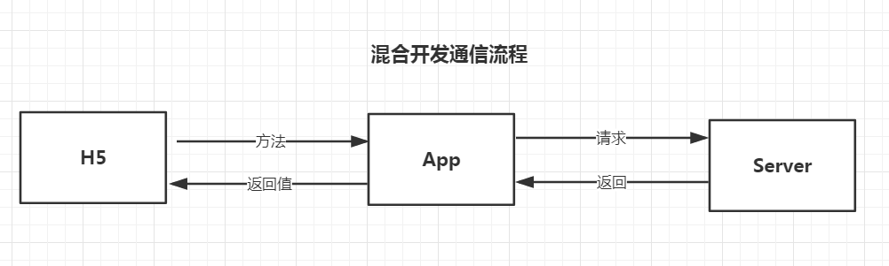
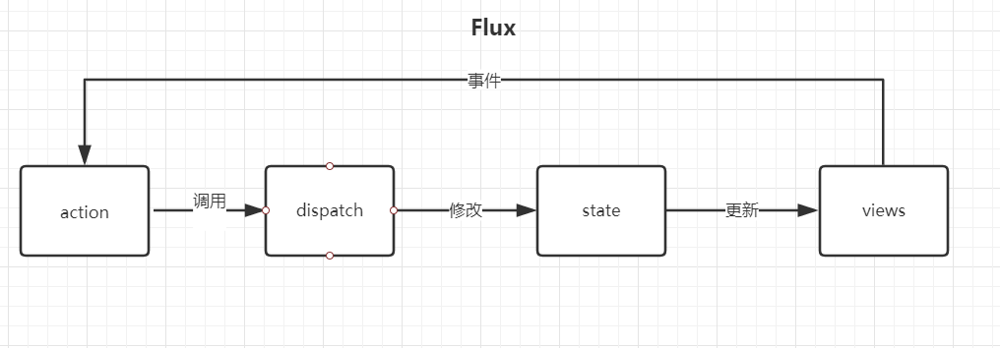
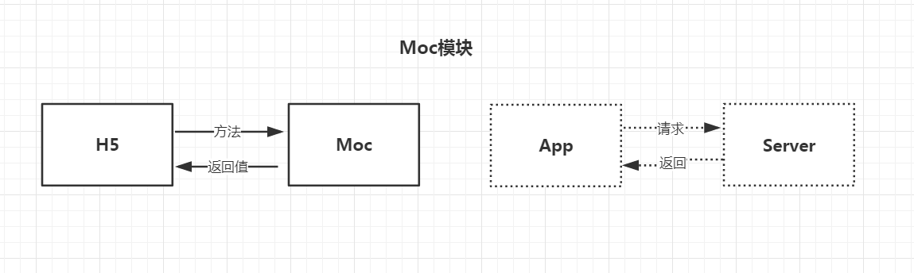
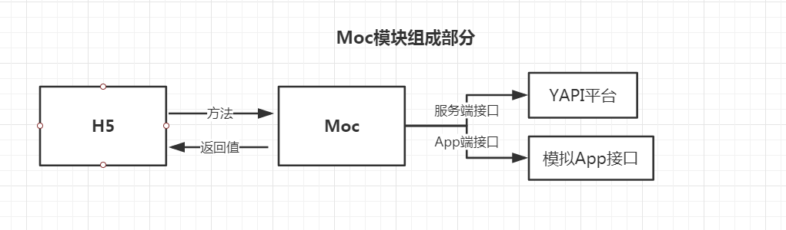

## 趣清理 v1.1 项目分享

1. 项目介绍
2. 代码介绍   
   2.1 关键技术点
       Redux
       Moc 层  
   2.2 调试流程
3. 项目中用到工具
4. 总结

### 1. 项目介绍

趣清理是手机助手孵化出一格新的 App，前端主要负责 H5 页面的开发工作。目前有下载、抽奖、邀请三大块功能。

这个项目相比传统项目的通信流程有所不同




### 2.代码介绍

代码实现`flux`思想：  



#### 2.1 关键技术

##### 2.1.1 Redux

为什么使用 Redux:

1. 单一数据源：管理数据成本降低（多人开发尤为重要);
2. 因为接口复杂，通过 action 封装接口，降低接口调用成本;(调用方不用关心接口)
3. action 将接口数据和本地数据打通;
4. 技术储备

使用 Redux 遇到两个问题

1. 异步化的`Action`
2. 订阅函数被频繁触发;

通过使用`thunk`中间件完成异步化的`Action`, 代码事例：

```js
export function getInvitedInfo(){
    return function(dispatch){
        fetch("GET_INVITED_INFO")({
            d: getNameVal("d")
        }, (data)=>{
            dispatch({
                type: "SET_INVITED_INFO",
                data: data
            });
        })
    }
}

```

封装`observerStore`方法可以对对象属性进行监听，代码事例:

```js
observeStore(store, (state)=>{
    return state.total;
}, (total, state)=>{    
    document.querySelector(".summary").innerHTML = _.template(summaryTpl)(state);         
});

```

##### 2.1.2 Moc层






### 3.项目使用的工具

- Fiddler
- Chrome Inspect
- YAPI
- Docs
- shell 脚本
- pscp(自动输入密码scp工具)

### 4.总结

* 原则一：保证开发流程通畅;
* 原则二：保证数据流程通畅;


保证开发流程通畅方法：
* 明确开发流程：比如开发环境和调试环境是什么，如何进行联调，如何部署代码等等;


保证数据流通畅方法：
* 梳理功能模块和通信接口，确定接口各个字段、类型、请求值、返回值，确定接口成功、失败等情况;
* 通过MOC值模拟接口数据;