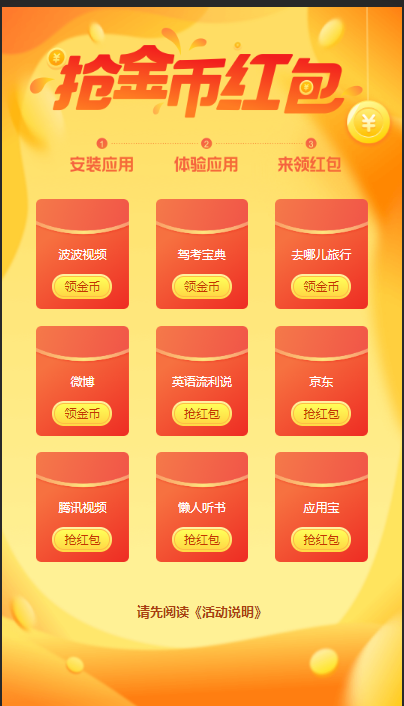

## 趣清理项目总结

本文目标
* 项目回顾
* 项目不足和原因
* 改进方式
* 场景举一反三

### 项目回顾
趣清理是以手机清理为切入点以赚钱为卖点的App。我的工作是开发其中两个H5页面：抢红包页面和抽奖页面。页面截图如下：

项目角色分为： 前端、客户端、服务端、第三方广告端

数据流方向：

抢红包页面有下载、安装、监听等功能。

抽奖页面是一个九宫格的跑马灯效果。

### 项目不足和原因

这个项目我开发特别心累。前端页面需要在客户端`webview`里面验证，但是客户端由于安全性问题增加很多限制条件，比如登录、加密墙、https、测试和线上环境等等，最终导致H5页面在webview中调试成本高。

因为数据链条节点太多，加上接口文档不完善，导致一些字段不明确，边界条件处理不清晰，最终导致开发的问题很多。

主要问题分为几大类：开发、调试、测试和部署

开发：
* H5和客户端接口过多，导致联调成本急剧上升;
* moc数据制造不足，要在`chrome://inspect`中调试，导致效率低下;
* 公共方法支持不够，比如通过`path`获取值方法没有;
* 接口文档不完善，导致有些字段、不同状态值不明确;

调试：
* 在客户端具有加密墙、登录、https、多种环境情况下，在客户端调试困难度很高;
* Fiddle、安装证书等操作每次都要手动设置;
* 短信验证码发送失败、无法登录、安装App失败无法走流程;
* 测试和线上环境通过host配置容易混乱;

测试：
* 没有做单元和自动化测试，总是出现一些简单的错误;

部署：
* 没有自动化部署脚本;

总结：

* 没有明确开发流程：比如开发环境和调试环境是什么，如何进行联调，如何部署代码等等;
* 由于没有和相关接口人梳理功能模块和接口文档，导致对数据流了解程度不高，开发时候遇到各种字段和边界条件问题都是前期工作没有做；
* 对H5和native混合开发困难程度预计不足，从而设计一个重H5版本架构，导致后续工作量直线上升;

### 改进方法

开发流程：

* 对于混合开发场景，一定先把开发、调试、联调和部署流程搞清楚，同时最大化减少和客户端接口数量，因为多一个接口会造成很大调试成本; 
* 对于混合开发场景：设计一个轻H5端, H5端主要功能是展示和交互，底层功能应该放在native端;
* 开发之前要梳理接口文档，确定关键字段和有无数据、单条多条、接口报错等多种情况下返回值;
* 开发前期通过Mock接口和方法，将前端页面功能开发完成，如果`宿主环境`复杂，可以考虑联调;

开发环境：
* 通过两个不同URL来区别线上和线下两种环境，避免使用host配置;

### 场景举一反三

常见多端开发如下：

* 服务端 + PC客户端 + web端
* PC客户端 + web端
* 微信 + web端
* App端 + web端

这些场景下开发原则：少走宿主方法、多走HTTP请求;

