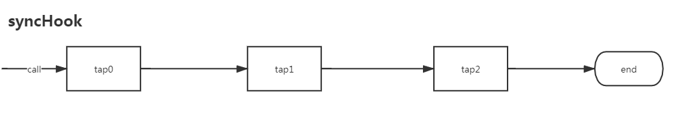
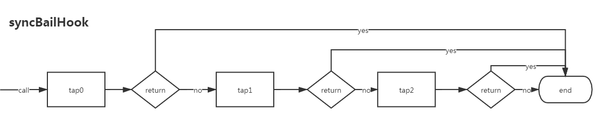
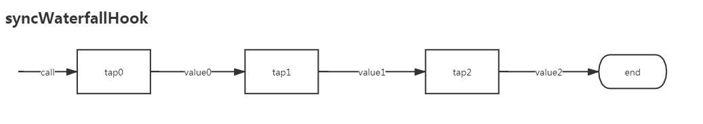
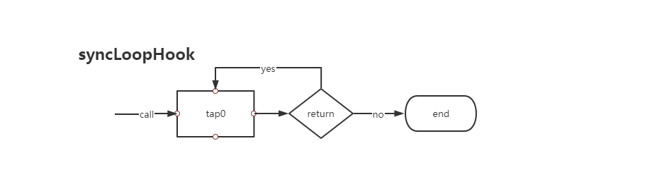
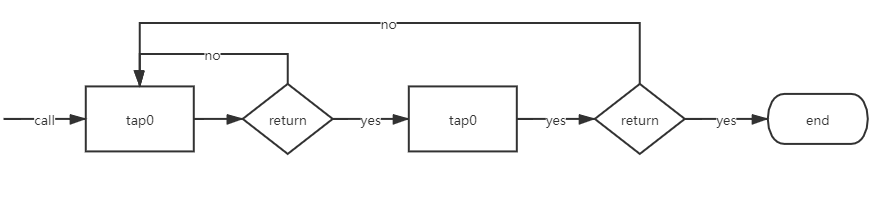
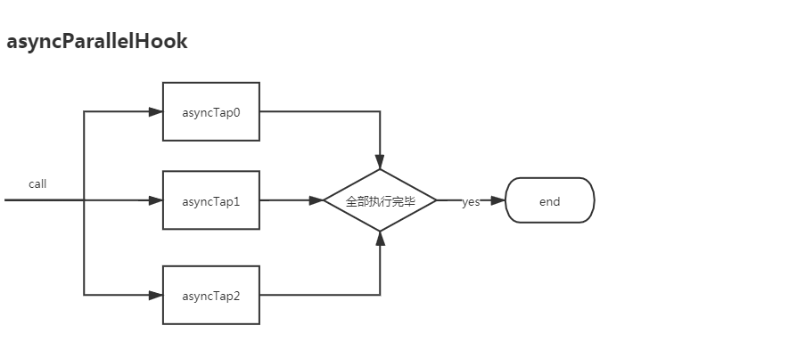
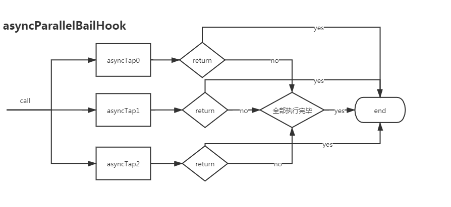
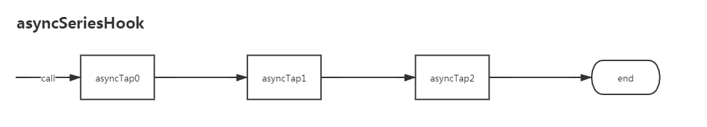
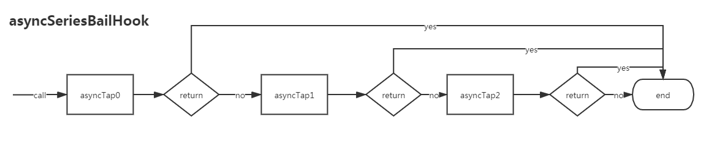
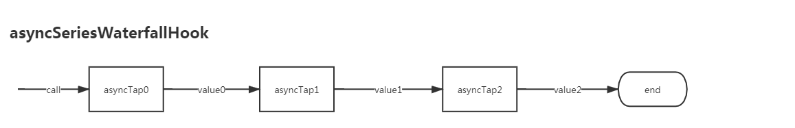

## tapable hook介绍

`tapable`是`webpack`重要的底层模块。理解`webpack`首先要理解`tapable`, 而`tapable hook`更是重中之重。

`tapable`主要提供各式各样的`hook`。主要有下面几种类型: 

* SyncHook
* SyncBailHook
* SyncWaterfallHook
* SyncLoopHook
* AsyncParallelHook
* AsyncParallelBailHook
* AsyncSeriesHook
* AsyncSeriesBailHook
* AsyncSeriesWaterfallHook

钩子的类型比较多，通过上面封面图分类看的会更加直观;
<!-- 
[点击查看图片来源](https://github.com/zgfang1993/blog/issues/41) -->


关键词介绍:
* Sync/Async: 同步/异步;
* Bail: 可退出`Hook`, 当订阅事件有`return`返回值时，则不执行之后的订阅事件;
* Waterfall: 可以传递值。当前一个事件可以把值传给后一个事件;
* Loop: 循环执行事件。当事件有`return`返回值时会循环执行当前事件，直到没有`return`返回值时才退出执行下一个事件;
* AsyncParallel: 异步并行;
* AsyncSeries: 异步串行;


常见的订阅/发布API
* tap: 订阅一个同步事件;
* call: 发布一个同步事件;
* tapAsync: 订阅一个异步事件;
* callAsync: 发布一个异步事件;


下面是每个Hook的流程图和介绍

### syncHook
  

`syncHook`是最基础的同步`hook`, 按照订阅的前后顺序执行; 示例代码如下:  
```js
import {SyncHook}  from "tapable";    
var synchook = new SyncHook(["name"]);
synchook.tap("tap0", (name)=>{
    console.log("I'm", a);
});
synchook.tap("tap1", (name)=>{
    console.log("I'm", name);
});
synchook.tap("tap2", (name)=>{
    console.log("I'm", name);
});
synchook.call("Ben");
```


### syncBailHook



`syncBailHook`相比`syncHook`增加一个退出机制：当有一个订阅事件有`return`返回值，则之后的事件都不触发了;  
`syncBailHook`可用于一些需要前置条件判断的场景; 示例代码如下:
```js
import {SyncBailHook}  from "tapable";  
var syncBailHook = new SyncBailHook(["name", "height"]);
syncBailHook.tap("tap0", (name, height)=>{        
    console.log("I'm", name);
    if(name == "Ben"){        
        return false;
    }        
});
syncBailHook.tap("tap1", (name, height)=>{
    console.log("I'm", name);
});

syncBailHook.tap("tap2", (name, height)=>{
    console.log("I'm", name);
});
syncBailHook.call("Ben");
```
上面代码当`tap0`事件有`return`时，`tap1, tap2`都不在触发了;

`syncBailHook`执行流程图如下


### syncWaterfallHook 
  
`syncWaterfallHook`相比`syncHook`增加一个传递值的功能：前面一个事件可以将值传递给下一个事件;  
`syncWaterfallHook`可用于一些流程化的场景，第一步得到的结果传给第二步使用;  


```js
import {SyncWaterfallHook}  from "tapable";  
var SyncWaterfallHook = new SyncWaterfallHook(["name"]);
SyncWaterfallHook.tap("tap0", (name, height)=>{        
    console.log("I'm Tom");
    return name + ",Tom"
});
SyncWaterfallHook.tap("tap1", (name, height)=>{
    console.log("I'm Piter");
    return name + ",Piter"
});

SyncWaterfallHook.tap("tap2", (name, height)=>{
    console.log("I'm Luci");
    return name + ",Luci"
});
SyncWaterfallHook.call("Ben");
```
执行结果:
```js
Ben,Tom,Piter,Luci
```


### syncLoopHook  
  

`syncLoopHook`相比`syncHook`增加一个循环机制：当订阅事件有`return`时会继续执行该事件，直到事件没有`return`再执行下一个事件;
`syncLoopHook`可以用于需要递归的场景，比如遍历树节点之类;示例代码如下:
```js
import {SyncLoopHook}  from "tapable";  
var syncLoopHook = new SyncLoopHook();
var num = 0;
syncLoopHook.tap("tap0", ()=>{
    console.log("tap0", num);
    if(num++ < 5){
        return false;    
    }
});
```
执行结果如下:
```
0
1
2
3
4
```
当有注册多个事件时需要注意一点：之后事件会把之前事件也执行一次。执行流程图如下:


### asyncParallelHook  
  

`asyncParallelHook`是同时触发所有异步注册事件，当所有注册事件都执行完毕后，整个发布事件才结束;  
`asyncParallelHook`应用的场景很多，比如请求多个接口合并数据; 

```js

var asyncParallelHook = new AsyncParallelHook([]);

asyncParallelHook.tapAsync("tap0", (cb)=>{
    console.log("tap0");
    setTimeout(()=>{
        cb();
    }, 2000);
});

asyncParallelHook.tapAsync("tap1", (cb)=>{
    console.log("tap1");
    setTimeout(()=>{
        cb();
    }, 4000);
});

asyncParallelHook.tapAsync("tap2", (cb)=>{
    console.log("tap2");
    setTimeout(()=>{
        cb();
    }, 4000);
});

// console.log(asyncParallelHook);
asyncParallelHook.callAsync(()=>{
    console.log("end");
});
```
执行结果
```js
// 2s后
tap0 
// 4s后
tap1
tap2
```

### asyncParallelBailHook
  
`asyncParallelBailHook`相比`asyncParallelHook`多了一个退出机制，和`syncBailHook`是一样的逻辑;  

`asyncParallelBailHook`可以应用在一些需要前置判断的场景，如果前置条件不成立，则退出整个流程; 

```js
var asyncParallelBailHook = new AsyncParallelBailHook();
asyncParallelBailHook.tapAsync("tapAsync0", (cb)=>{    
  cb();
  return false;
});

asyncParallelBailHook.tapAsync("tapAsync1", (cb)=>{  
  cb();
});

asyncParallelBailHook.callAsync(()=>{
    console.log("end");
});
asyncParallelBailHook.call();

```


### asyncSeriesHook 
  
`asyncSeriesHook`是按照注册的前后顺序触发异步事件，一个异步事件执行完毕后才能触发下一个。  

`asyncSeriesHook`可以应用场景很多,相比`syncHook`同步事件，`asyncSeriesHook`可以执行一些异步事件;  

```js
var asyncSeriesHook = new AsyncSeriesHook();
asyncSeriesHook.tapAsync("tapAsync0", (cb)=>{    
    setTimeout(()=>{
        cb && cb()
    }, 5000);
}); 

asyncSeriesHook.tapAsync("tapAsync1", (cb)=>{    
    setTimeout(()=>{
        cb && cb()
    }, 1000);    
});

asyncSeriesHook.callAsync(()=>{
    console.log("end");
});
```

### asyncSeriesBailHook  
 
`asyncSeriesBailHook`相比`asyncSeriesHook`多了一个退出机制，和`syncBailHook`是一样的逻辑;  
`asyncSeriesBailHook`可以应用在一些需要异步判断前置条件的场景，如果前置条件不成立则退出整个流程;  

```js
var asyncSeriesBailHook = new AsyncSeriesBailHook(["sum"]);
asyncSeriesBailHook.tapAsync("tapAsync0", (sum, cb)=>{
    console.log("sum", sum);
    setTimeout(()=>{
        // cb && cb(false);        
        return;
    }, 2000);
    
    
}); 

asyncSeriesBailHook.tapAsync("tapAsync1", (sum, cb)=>{
    console.log("sum", sum);    
    setTimeout(()=>{
        cb && cb(false);
    }, 1000);
    
});

asyncSeriesBailHook.callAsync(1, (sum)=>{
    console.log("end", "sum", sum);
});

```

### asyncSeriesWaterfallHook
 
`asyncSeriesWaterfallHook`相比`asyncSeriesHook`多了一个传值功能，和`syncWaterfallHook`是一样的逻辑;  

`asyncSeriesWaterfallHook`可以应用在异步流程化的场景，比如将一个异步请求接口值传给下一个;  

```js
var asyncSeriesWaterfallHook = new AsyncSeriesWaterfallHook(["sum"]);
asyncSeriesWaterfallHook.tapAsync("tapAsync0", (sum, cb)=>{    
    console.log("sum", sum);
    setTimeout(()=>{
        cb && cb(null, ++sum);        
    }, 2000);
    
}); 

asyncSeriesWaterfallHook.tapAsync("tapAsync1", (sum, cb)=>{    
    console.log("sum", sum);
    setTimeout(()=>{
        cb && cb(null, ++sum);        
    }, 1000);    
});

asyncSeriesWaterfallHook.callAsync(1, (sum)=>{
    console.log("end",  sum);
});

```
到这里已经介绍完9个`hook`，通过这9个`hook`可以覆盖各种各样的业务场景。  
最后我想简单说一下`hook`这种设计模式的优缺点。我认为有封装和扩展两个优点。通过`hook`设计可以将相同功能代码放在一起实现代码拆分和封装。通过增加`hook`方式很容易实现功能的扩展。我认为有一个缺点：需要遵循一定调用规范，需要事先了解Hook相关API和返回值等。  
`hook`设计模式整体来说还是利大于弊，底层采用分治的设计思想。`hook`特别适合功能复杂和功能经常需要扩展的场景下使用。